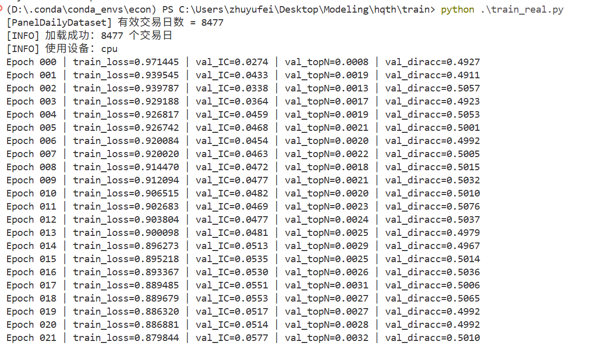

### 模型训练表现
run`python .\train_real.py`,可在真实面板数据上训练模型

模型在真实面板数据上的训练过程表现稳定，验证集横截面指标呈现持续提升的趋势。训练前期 IC 仅约 0.027，在 20 余个 epoch 后提升至 0.057 左右；Top-N long-short 收益从 0.0008 增长到 0.0032，显示模型的排序能力显著增强。训练损失稳步下降，同时验证集指标也同步改善，说明模型未出现明显过拟合。总体而言，该模型成功学习到有效的横截面结构，在排序与 IC 指标上均获得持续收益提升。但是仍有优化的空间。